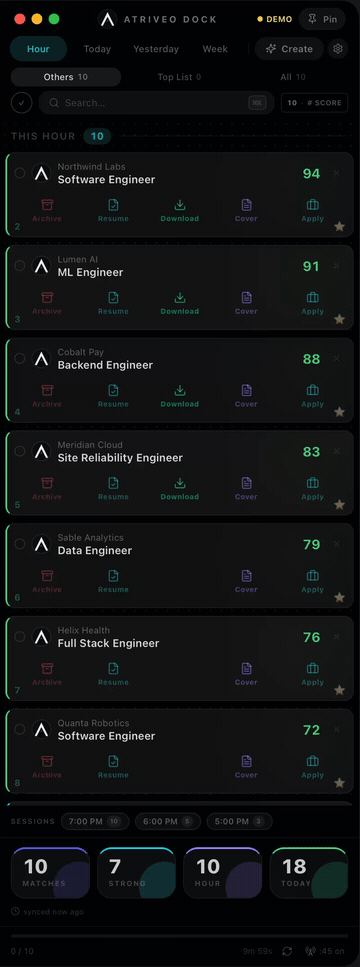
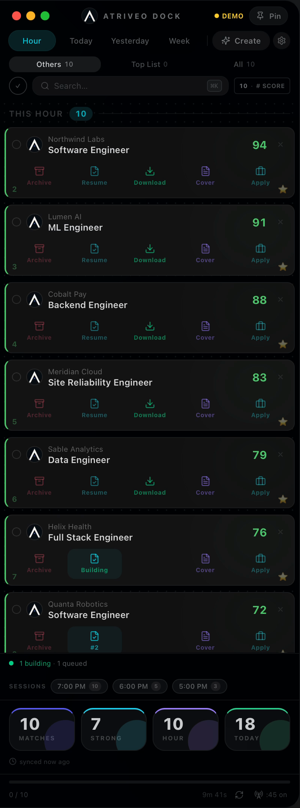
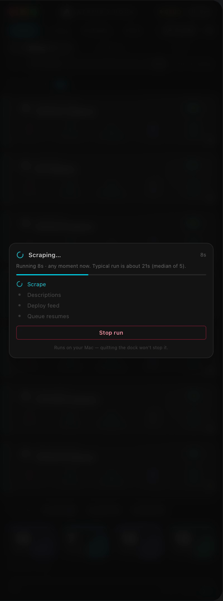
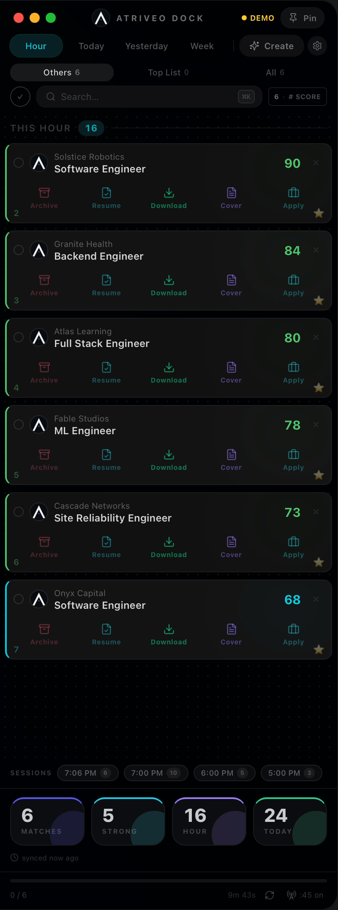
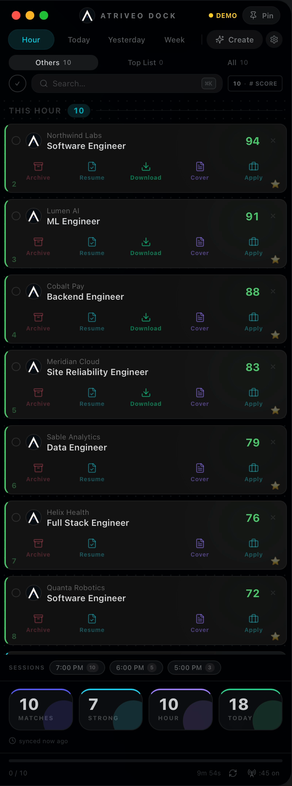
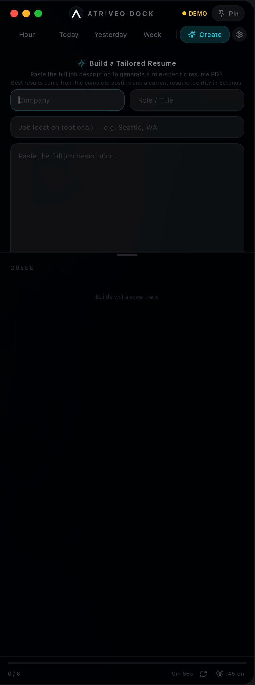
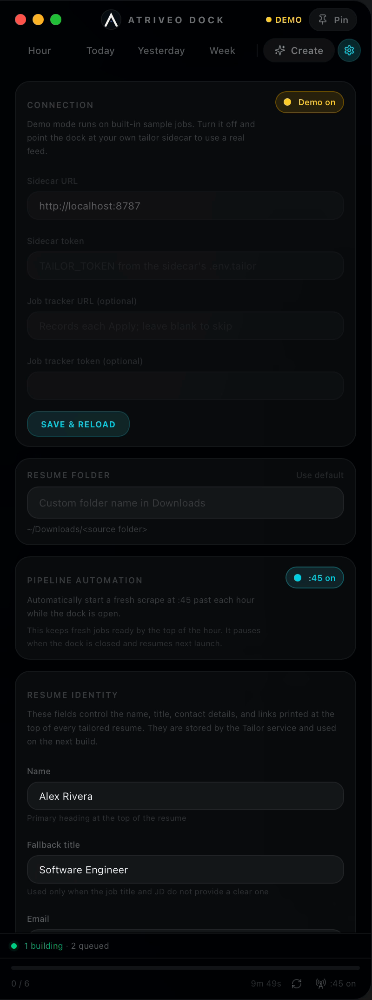
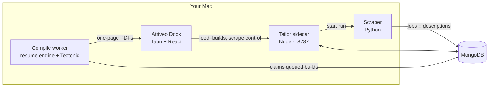

<div align="center">

# Atriveo Dock

**A native macOS sidebar for your job search: a ranked live job feed, one-click tailored resumes and cover letters, and an hourly scrape that runs while you work.**

[](https://github.com/atishay-kasliwal/atriveo-job-dock/releases/latest)
[](https://github.com/atishay-kasliwal/atriveo-job-dock/actions/workflows/build.yml)
[](LICENSE)


[**Download for macOS**](https://github.com/atishay-kasliwal/atriveo-job-dock/releases/latest) · [Watch the demo](docs/media/demo.mp4) · [How it works](#how-it-works)



</div>

---

Applying to dozens of roles a week means juggling job boards, a spreadsheet, and a resume you rewrite by hand. Atriveo Dock pins all of it to the edge of your screen. It shows a scored feed of fresh postings, builds a one-page resume tailored to each one, keeps track of what you applied to, and refreshes itself every hour.

It's open source, private by default, and it **runs in demo mode right after install**, so you can try every screen before connecting anything.

## Features

- **Ranked live feed.** New postings by hour, today, yesterday, and week, scored against your stack so the best matches come first. Search with ⌘K.
- **Tailored resumes in one click.** Each posting gets a one-page PDF built from your own accomplishment bank. Postings that don't fit fall back to a clean general resume instead of nothing.
- **Bulk building.** Every fresh job gets a resume queued automatically after each scrape, so the Download button is already waiting.
- **Cover letters.** Generated per posting from the same profile.
- **Paste any job.** The Create tab builds a resume from a description you paste, with the posting's city in the header.
- **Hourly auto-scrape.** While the dock is open it runs the pipeline at :45 past each hour. A panel shows each phase live and closes itself when the run succeeds.
- **Apply tracking.** Marking a job applied can also record it in your job tracker.
- **Built for the desktop.** A frosted-glass sidebar with a menu-bar icon, pin-on-top, and ⌘⇧J to show or hide it from any app.

## Screenshots

<table>
  <tr>
    <td align="center"><br><sub>Ranked feed, resumes building</sub></td>
    <td align="center"><br><sub>Hourly scrape, phase by phase</sub></td>
    <td align="center"><br><sub>New jobs, resumes ready</sub></td>
  </tr>
  <tr>
    <td align="center"><br><sub>⌘K search</sub></td>
    <td align="center"><br><sub>Paste any job description</sub></td>
    <td align="center"><br><sub>Connection, demo mode, resume identity</sub></td>
  </tr>
</table>

## Install

1. Download **`Atriveo-Dock-<version>-universal.dmg`** from the [latest release](https://github.com/atishay-kasliwal/atriveo-job-dock/releases/latest). It runs natively on Apple Silicon and Intel, macOS 11 or later.
2. Open it and drag **Atriveo Dock** into **Applications**.
3. **First launch:** the app is open source but not notarized by Apple, so right-click it and choose **Open**, then **Open** again. You only need to do this once.

It opens in **demo mode** with sample jobs (every company in it is fictional), so you can click through the whole app straight away.

## Connect your own backend

Demo mode needs nothing. For a real feed, Atriveo Dock talks to a small HTTP service, the *tailor sidecar*, which serves jobs and builds PDFs:

1. Run the sidecar and the scraper from the Atriveo pipeline:
   - [`atriveo-app`](https://github.com/atishay-kasliwal/atriveo-app): the sidecar (`npm run tailor`, on `http://localhost:8787`), the resume compile worker, and the resume engine.
   - [`job-pipeline`](https://github.com/atishay-kasliwal/job-pipeline): the scraper, filters, and scoring, storing to MongoDB.
2. In the dock, open **Settings → Connection**, turn **Demo** off, and enter the sidecar URL and the `TAILOR_TOKEN` from the sidecar's `.env.tailor`.
3. Click **Save & reload**.

Your connection is saved only on your Mac, in `~/Library/Application Support/com.atriveo.dock/connection.json`. No token is compiled into the app.

Prefer your own backend? Anything that implements the [API below](#sidecar-api) works. [`src/demo/demoServer.ts`](src/demo/demoServer.ts) is a complete in-process reference implementation.

## How it works



- The **dock** is a Tauri 2 app: a React and TypeScript UI over a small Rust shell that handles the window, tray, global shortcut, and file saving.
- The **sidecar** serves the feed and the resume queue, and starts scrape runs on demand: when you click scrape, or at :45 each hour while the dock is open.
- The **scraper** collects postings, filters and scores them, and stores them. Each run then exports descriptions, publishes the feed, and queues a resume for every new job.
- The **worker** builds each resume deterministically from your own accomplishment bank, so nothing on the page is invented. It compiles the result to a one-page PDF with Tectonic.

### Sidecar API

Every request carries an `X-Tailor-Token` header.

| Method | Path | Purpose |
|---|---|---|
| `GET` | `/jobs?type=hour\|today\|yesterday\|week` | The feed: `{ jobs: Job[] }` |
| `GET` | `/compile-queue?limit=N` | Resume build states for this machine |
| `POST` | `/compile-queue/lookup` | Build states for specific job URLs |
| `POST` | `/compile-enqueue` | Queue one resume build |
| `POST` | `/compile-enqueue-batch` | Queue up to 50 builds |
| `POST` | `/cover-enqueue` | Build a cover letter, returns `pdf_path` |
| `POST` | `/manual-jd` | Save a pasted job description |
| `GET` / `POST` | `/scrape/status`, `/scrape/start`, `/scrape/cancel` | Run the pipeline and watch its phases |
| `GET` / `PUT` | `/resume-profile` | Name and contact details printed on resumes |

## Build from source

Requirements: macOS, [Node.js](https://nodejs.org) 20+, [Rust](https://rustup.rs), and the Xcode Command Line Tools.

```bash
git clone https://github.com/atishay-kasliwal/atriveo-job-dock.git
cd atriveo-job-dock
npm ci
npm run tauri dev        # run with hot reload
```

Release build, as published (universal DMG):

```bash
rustup target add x86_64-apple-darwin aarch64-apple-darwin
npm run build
CI=true npm run tauri build -- --target universal-apple-darwin --bundles app,dmg
```

The DMG lands in `target/universal-apple-darwin/release/bundle/dmg/`.

To replay the scripted demo used for the video above, launch a build with `ATRIVEO_DOCK_TOUR=1`:

```bash
ATRIVEO_DOCK_TOUR=1 "target/release/bundle/macos/Atriveo Dock.app/Contents/MacOS/atriveo-dock"
```

## Privacy

- In demo mode all job data is generated on your Mac. The only outside requests are company logo lookups (Clearbit, then Google's favicon service).
- In live mode it talks only to the sidecar and job tracker **you** configure, plus those logo lookups.
- Tokens live in your user settings file, never in the app bundle or this repository.

## Contributing

Issues and pull requests are welcome. See [CONTRIBUTING.md](CONTRIBUTING.md). Good first areas: more job sources, Windows and Linux builds, and accessibility.

## License

[MIT](LICENSE) © 2026 Atishay Kasliwal
